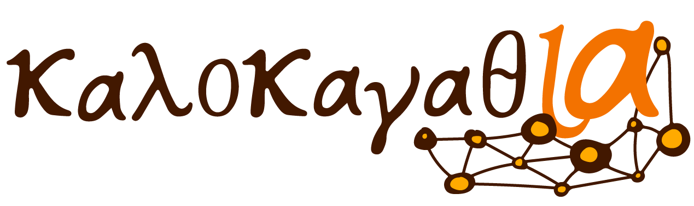

# KalokagathIA

This repository holds the information of the project KalokagathIA, which is part of 4th Edition of Saturdays4AI Madrid.

KalokagathIA aims to address issues that have long preoccupied humanity, specifically those related to determining the authorship of ancient texts.

The objective of this project has been to develop the first version of a tool for the automatic classification by author of Ancient Greek texts by using NLP techniques.

This tool will serve to support philologists and the academic community in general, to whom it will provide a completely new perspective to streamline both the classification process for newly found texts as well as the revision of classic texts of doubtful authorship and in general shed a new light that it could reveal details that have been going unnoticed for centuries.

To obtain the data, we have resorted to the Perseus Digital Library Project, an international initiative for the digitization of classical texts in different languages (Greek, Latin, Arabic, ...)

Two scrapers have been developed in Python, you can find them in the "SCRAPPERS" directory.

This has allowed us to obtain a dataset with more than 50 authors and the equivalent of about 110 Quixotes of text. The structure of the dataset, as you can see, is very simple and consists of only 4 fields: (Author, Work, Fragment and the Text in Greek). You can find the dataset in the "DATA" directory.

From these data, we have applied a preliminary cleaning and we have separated the training subset from the validation subset. You can find the code in the "CLEANING" directory.

We have used BERT algorithm with a model pretrained in Greek, which we have retrained in with our dataset. You can find this code in the "TRAINING" directory.

The directory "VALIDATION" contains code which uses the model with the validation dataset and interperts the results.

Finally we have also provided a Mockup of the Kalokagathia Web App in the "KALOKAGATHIA_WEBAPP" directory. This webapp has been coded using Django framework and it will be integrated with our python scripts to be able to offer the functionality to end users who will be able to clasify their texts and provide feedback about the results. This feedback will be used periodically to retrain the model and enhance the results.
